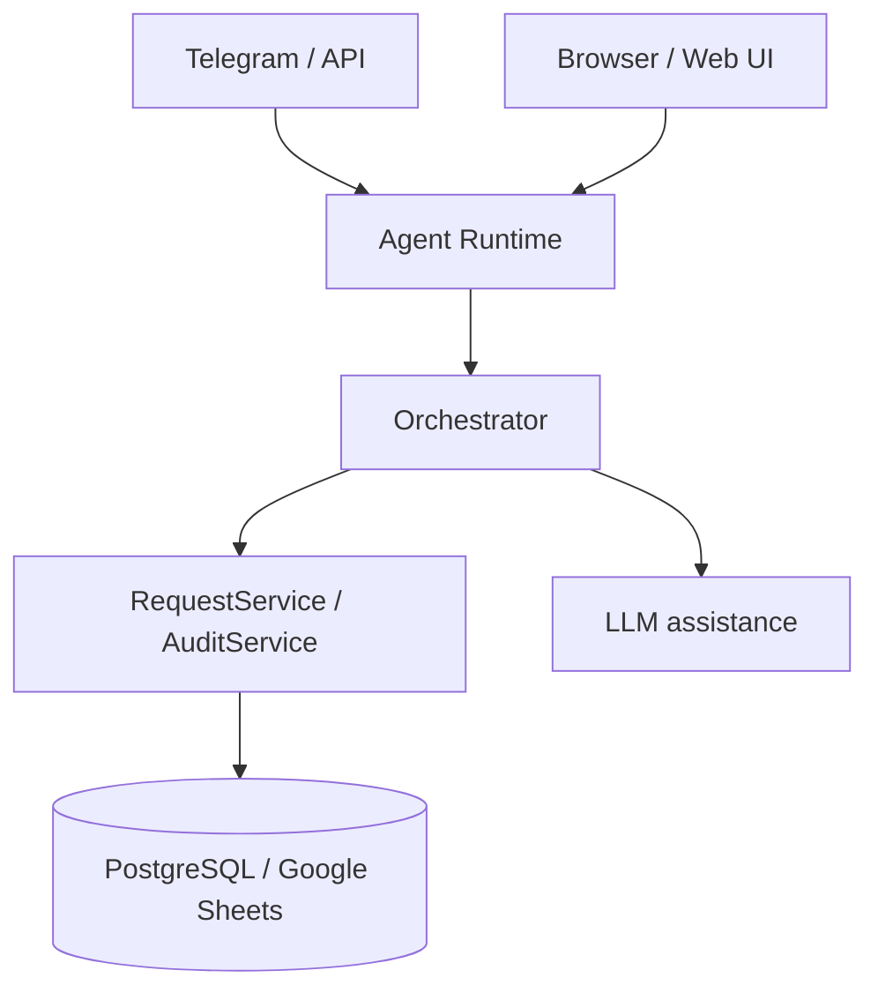

# marker-checker

Chat-first approval agent for a simple marker-checker workflow.

## What It Does

- requester sends a change request in Telegram or API
- agent normalizes the request and asks for confirmation
- approver approves, rejects, requests more info, or cancels
- request state and audit history are stored in PostgreSQL (default) or Google Sheets
- optional LLM assistance helps parse free-form text and rewrite responses

## System Shape



## Quick Start

Install dependencies:

```bash
make install
```

Run locally (loads `deploy.env`, runs in polling mode):

```bash
make run
```

Run the frontend dev server (port 3000):

```bash
make frontend
```

Run tests:

```bash
make test
```

Regenerate the AsyncAPI spec and TypeScript types from Python contracts:

```bash
make contracts
```

Validate config only:

```bash
make config-check
```

## Main Config

- `runtime.yaml` — non-secret app config (committed to git)
- `runtime.local.yaml` — local overrides (gitignored, e.g. `telegram: mode: polling`)
- `deploy.env` — secret env vars for AgentBase deploy (gitignored, copy from `deploy.example.env`)
- `.greennode.json` — IAM credentials for AgentBase CLI (gitignored, copy from `.greennode.example.json`)

To set up from scratch:

```bash
cp deploy.example.env deploy.env
cp .greennode.example.json .greennode.json
# fill in secrets: TELEGRAM_BOT_TOKEN, POSTGRES_DSN, AI_API_KEY, client_id, client_secret
```

Minimum values you need (postgres backend, default):

- `telegram.bot_token`
- `POSTGRES_DSN` (in `deploy.env`)
- `IMAGE_REPO`, `RUNTIME_ID`, `FLAVOR` (required in `deploy.env` for deploy targets)

For Google Sheets backend instead, set `persistence.backend: google_sheets` in `runtime.local.yaml` and provide:

- `google_sheets.spreadsheet_id`
- one Google credential source:
  `service_account_file` or `service_account_json_base64`

Optional AI config:

- `ai.enabled`
- `ai.model`
- `ai.base_url`
- `ai.api_key`

## Main Commands

- plain text message: create or continue a request
- `/confirm`
- `/approve REQ-...`
- `/reject REQ-... reason`
- `/needinfo REQ-... note`
- `/cancel REQ-...`
- `/status REQ-...`
- `/history REQ-...`

## Deploy

Build, push, and update the AgentBase runtime in one step:

```bash
make deploy
```

Or build the image locally only:

```bash
make docker-build
```

## Web UI

Chat-first web interface served from the same container. Enable by setting `GOOGLE_CLIENT_ID`, `GOOGLE_CLIENT_SECRET`, and `GOOGLE_SESSION_SECRET` in `deploy.env`. See [Web UI](docs/technical-design/web-ui.md).

WebSocket message types are defined in `agent/src/agent/contracts/ws.py` and auto-generated into `contracts/asyncapi.yaml` + `frontend/src/lib/generated/ws-contract.ts` via `make contracts`.

## Docs

- [docs/README.md](docs/README.md)
- [Product Overview](docs/product-spec/overview.md)
- [Workflow And Lifecycle](docs/product-spec/workflow-and-lifecycle.md)
- [Architecture](docs/technical-design/architecture.md)
- [Web UI](docs/technical-design/web-ui.md)
- [Configuration And Integrations](docs/technical-design/configuration-and-integrations.md)
- [Implementation Plan](docs/delivery-plan/implementation-plan.md)
