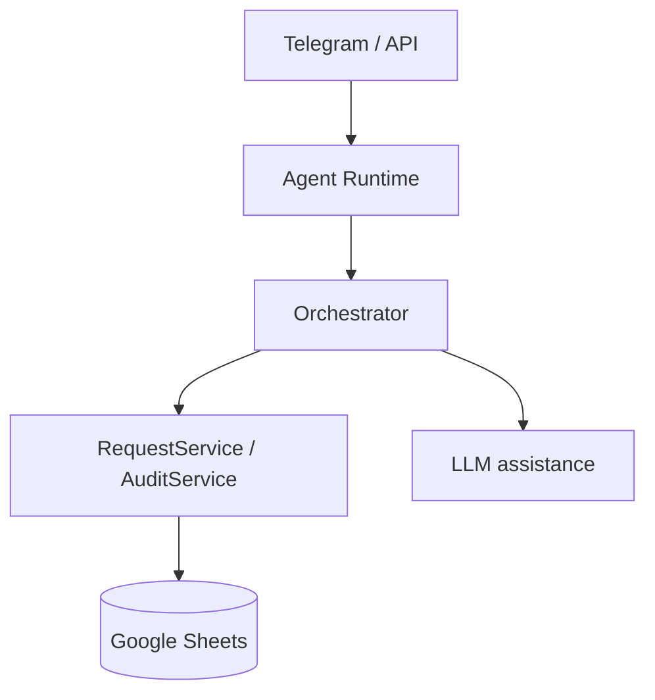

# marker-checker

Chat-first approval agent for a simple marker-checker workflow.

## What It Does

- requester sends a change request in Telegram or API
- agent normalizes the request and asks for confirmation
- approver approves, rejects, requests more info, or cancels
- request state and audit history are stored in Google Sheets
- optional LLM assistance helps parse free-form text and rewrite responses

## System Shape



## Quick Start

Create local config:

```bash
cp runtime.example.yaml runtime.yaml
```

Install and set up:

```bash
make setup
```

Run locally:

```bash
make run
```

Run tests:

```bash
make test
```

Validate config only:

```bash
make config-check
```

## Main Config

- `runtime.yaml` — local app config (gitignored, copy from `runtime.example.yaml`)
- `deploy.env` — runtime env vars for AgentBase deploy (gitignored, copy from `deploy.example.env`)
- `.greennode.json` — IAM credentials for AgentBase CLI (gitignored, copy from `.greennode.example.json`)

To set up from scratch:

```bash
cp runtime.example.yaml runtime.yaml
cp deploy.example.env deploy.env
cp .greennode.example.json .greennode.json
# fill in secrets: TELEGRAM_BOT_TOKEN, GOOGLE_SERVICE_ACCOUNT_JSON_BASE64, AI_API_KEY, client_id, client_secret
```

Minimum values you need:

- `telegram.bot_token`
- `google_sheets.spreadsheet_id`
- one Google credential source:
  `service_account_file` or `service_account_json_base64`

Optional AI config:

- `ai.enabled`
- `ai.model`
- `ai.base_url`
- `ai.api_key`

## Main Commands

- plain text message: create or continue a request
- `/confirm`
- `/approve REQ-...`
- `/reject REQ-... reason`
- `/needinfo REQ-... note`
- `/cancel REQ-...`
- `/status REQ-...`
- `/history REQ-...`

## Deploy

Local image build:

```bash
make docker-build
```

Typical prompt:

```text
Use /agentbase-deploy to redeploy this repo as the existing Custom Agent.
Use `deploy.env` as the runtime env file.
Use AgentBase managed Container Registry.
Use linux/amd64.
Use the existing flavor and PUBLIC mode.
```

## Docs

- [docs/README.md](docs/README.md)
- [Product Overview](docs/product-spec/overview.md)
- [Workflow And Lifecycle](docs/product-spec/workflow-and-lifecycle.md)
- [Architecture](docs/technical-design/architecture.md)
- [Configuration And Integrations](docs/technical-design/configuration-and-integrations.md)
- [Implementation Plan](docs/delivery-plan/implementation-plan.md)
