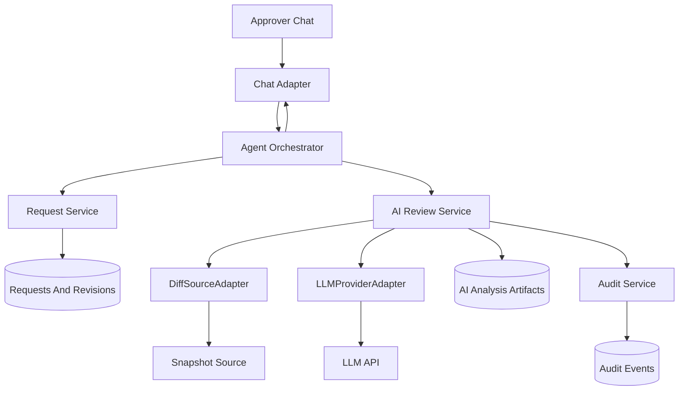
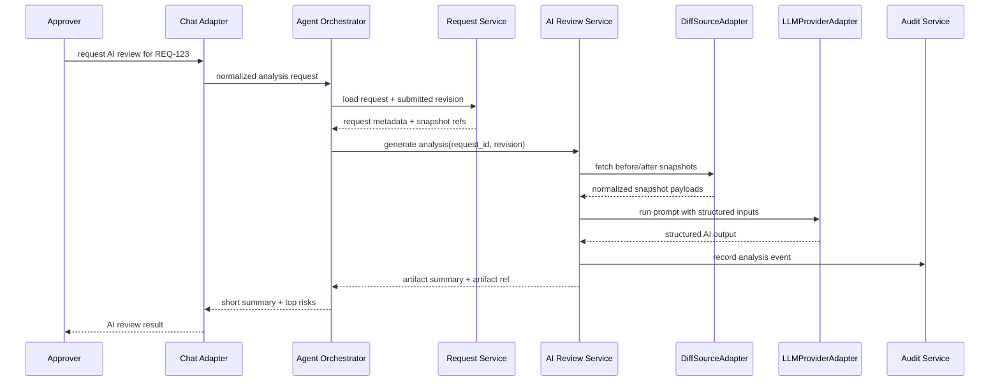

# AI Review Assistance

## Purpose

This document defines where AI review assistance belongs in the system, how it should be triggered, what inputs it needs, what outputs it should produce, and which parts should be configurable.

This capability is a later-stage extension. It should improve reviewer speed and clarity without becoming the source of workflow truth.

## Proof-First Recommendation

Do not build AI review assistance before the core approval workflow is already useful on its own.

The product should prove these features first:

- requester can submit a request cleanly
- approver can review and decide cleanly
- lookup and audit are reliable

Only after that should AI be added.

When AI is added, the first version should stay intentionally small:

- on-demand only
- approver-facing only
- one submitted revision at a time
- one LLM provider adapter
- one diff source adapter
- no MCP requirement
- no background worker
- no separate AI service

## Role In The System

AI review assistance is:

- advisory only
- attached to one request and one submitted revision
- optional by configuration
- non-authoritative for workflow state

AI review assistance is not:

- a replacement for the approver
- a direct mutator of `review_status`
- a reason to bypass missing data checks
- a requirement for core request submission

## Recommended Placement

For the first AI-enabled version, place AI review assistance inside the same application service, behind a small service boundary.

Recommended placement:

1. `Agent Orchestrator` decides whether AI analysis should run.
2. `Request Service` remains the source of request state and revision state.
3. `AIReviewService` fetches inputs, builds prompts, calls the model provider, validates output, and stores the artifact.
4. `Audit Service` stores analysis metadata and references.
5. `Chat Adapter` only displays AI results; it does not generate them directly.

Recommended rule:

- do not embed AI generation logic inside chat adapters
- do not embed AI generation logic inside raw state transition code
- call AI review assistance only after a request has a canonical request ID and submitted revision

## Simplified Component Diagram

## Sequence Diagram

## Component Breakdown

These are the only components the first AI-enabled version needs.

| Component | Type | Required | Responsibility |
|---|---|---|---|
| `Agent Orchestrator` | core service | Yes | decides when AI review should run |
| `Request Service` | core service | Yes | loads request state and revision state |
| `AIReviewService` | core service | Yes for AI mode | runs the end-to-end AI review flow |
| `DiffSourceAdapter` | adapter | Yes for AI mode | fetches `before` and `after` snapshots |
| `LLMProviderAdapter` | adapter | Yes for AI mode | calls the model provider and returns structured output |
| `AI Artifact Store` | repository | Yes for AI mode | stores AI analysis artifacts |
| `Audit Service` | core service | Yes | records analysis-related events |

These behaviors should start as internal functions inside `AIReviewService`, not as separate components:

- snapshot normalization
- redaction
- prompt construction
- output validation

## Interface Catalog

These are the only interfaces worth formalizing first.

| Interface | Purpose | Suggested Methods |
|---|---|---|
| `AIReviewService` | coordinates one AI review run | `generate_review`, `get_artifact`, `can_analyze` |
| `AIArtifactRepository` | persists analysis artifacts | `save_artifact`, `get_artifact_by_id`, `list_by_request_revision` |
| `DiffSourceAdapter` | fetches raw change snapshots | `get_before_snapshot`, `get_after_snapshot`, `get_snapshot_metadata` |
| `LLMProviderAdapter` | invokes the model provider | `generate_structured_output`, `health_check` |

Optional later interfaces:

- `MCPToolAdapter`
- `PromptTemplateProvider`
- `PolicyGuidanceProvider`

## Minimal Implementation Set

If the team wants the smallest useful AI slice, these are the minimum parts to implement:

1. `AIReviewService`
2. `DiffSourceAdapter`
3. `LLMProviderAdapter`
4. `AIArtifactRepository`
5. one approver chat action to trigger on-demand analysis

Everything else can stay lightweight at first:

- normalization can stay inside `AIReviewService`
- redaction can start with simple field exclusion rules
- output validation can stay local to `AIReviewService`
- policy guidance can be optional
- MCP support can remain out of scope

## Interaction Surface: API vs MCP

AI review assistance does not require MCP by default.

Recommended default:

- use normal application-side adapters that call external APIs directly
- keep those API calls behind internal interfaces such as `DiffSourceAdapter` and `LLMProviderAdapter`

Use this default when:

- the application already knows when to fetch data
- the integration is deterministic and request-driven
- the system only needs a few controlled external calls

MCP is optional and should be introduced only when it adds real value.

Consider MCP when:

- the AI needs tool-style access to multiple external systems
- the AI may need to choose among several retrieval tools dynamically
- a provider already exposes a useful MCP-compatible surface
- you want a uniform tool protocol across several external systems

Recommended rule:

- default to direct API adapters for the first AI-enabled version
- add an MCP-backed adapter later only if tool orchestration becomes a real need

If MCP is added later, it should still sit behind the same abstraction boundary:

- `DiffSourceAdapter` may be implemented by direct API calls or by an MCP client
- another retrieval adapter may be implemented by direct API calls or by an MCP client if the product later needs it
- workflow code should not care which one is used

## Execution Position In Workflow

AI review assistance should run only after these conditions are true:

- request exists
- request has a submitted revision
- required snapshot inputs exist
- AI review is enabled for that request type or target type

Recommended default for the first AI-enabled version:

- `on_demand` by approver request

Do not auto-trigger AI in the first AI-enabled version.

## Trigger Modes

| Mode | Description | When It Fits | Recommended |
|---|---|---|---|
| `disabled` | AI analysis never runs | core workflow only | no |
| `on_demand` | approver explicitly requests analysis | safest first AI rollout | yes |
| `auto_on_submission` | analysis runs after initial submitted revision | useful when snapshots are always available | maybe later |
| `auto_on_resubmission` | analysis reruns after `needs_info` resubmission | useful for complex review loops | maybe later |
| `always_auto` | run on every submitted revision | only when cost and latency are acceptable | no |

## End-To-End Analysis Flow

Recommended flow:

1. Orchestrator resolves `request_id` and `last_submitted_revision`.
2. AI review service loads request metadata and snapshot references.
3. `DiffSourceAdapter` fetches `before` and `after` payloads.
4. `AIReviewService` normalizes inputs, applies simple redaction, and builds the prompt.
5. `LLMProviderAdapter` calls the selected model.
6. `AIReviewService` validates the output shape.
7. Artifact store saves the analysis record.
8. Orchestrator returns a short summary to the approver and keeps the full artifact for lookup.

## Required Inputs For AI

AI review assistance should not run unless the minimum required analysis inputs are available.

### Required Inputs

| Field | Why It Is Needed |
|---|---|
| `request_id` | Links analysis to one request |
| `request_revision` | Links analysis to one exact submitted revision |
| `before_snapshot_ref` | Source of current-state data |
| `after_snapshot_ref` | Source of proposed-state data |
| `snapshot_schema_version` | Tells the normalizer how to parse the snapshots |

### Strongly Recommended Inputs

| Field | Why It Helps |
|---|---|
| `target_label` | Better summary context |
| `target_object_type` | Better prompt specialization |
| `change_type` | Better review focus |
| `business_reason` | Helps AI compare requested intent to proposed change |

### Optional Inputs

| Field | Use |
|---|---|
| requester note history | extra context for why the change exists |
| approver questions so far | helps analysis focus on unresolved concerns |
| object metadata | environment, owner, version, tags, or similar |
| policy or review guidance | optional domain-specific hints when the product really needs them |

## AI Output Contract

The AI service should return structured output, not only free text.

Recommended output fields:

| Field | Description |
|---|---|
| `summary` | Short plain-language explanation of the change |
| `structured_diff` | Normalized list of changed fields or sections |
| `risk_hints` | Potential risks or suspicious patterns |
| `missing_context` | Information the AI believes is still missing |
| `questions_for_approver` | Suggested follow-up questions |
| `checklist` | Suggested review checklist |
| `analysis_status` | `completed`, `failed`, `skipped`, or `partial` |
| `model_provider` | Which provider generated the analysis |
| `model_name` | Which model generated the analysis |
| `prompt_version` | Prompt template version used |
| `created_at` | Analysis creation time |

Recommended chat presentation:

- show only a short summary plus top risks in chat
- keep the full structured artifact for lookup or later display

## Configurable AI Settings

AI review assistance should be configurable without code changes.

Recommended configuration areas:

### Enablement

- `enabled`
- `trigger_mode`
- `allowed_target_types`
- `allowed_change_types`
- `integration_mode` such as `api` or `mcp`

### Model Runtime

- `provider`
- `model_name`
- `temperature`
- `max_output_tokens`
- `timeout_seconds`
- `retry_count`

Recommended default behavior:

- low temperature
- bounded output length
- short timeout with safe fallback

### Prompting

- `prompt_version`
- `system_instruction_template`
- `risk_ruleset_version`
- `checklist_template_version`

### Input Control

- `max_snapshot_size_bytes`
- `max_fields_per_analysis`
- redaction rules
- truncation strategy

### Output Visibility

- approver-only visibility by default
- whether requester may see a simplified AI summary later
- whether non-participants may ever see AI output

### Storage

- whether to persist full raw model output
- whether to persist normalized-only artifact
- artifact retention period

## Recommended Data Model For AI Artifacts

Recommended `ai_analysis_artifacts` fields:

| Field | Description |
|---|---|
| `artifact_id` | Unique artifact identifier |
| `request_id` | Parent request |
| `request_revision` | Revision analyzed |
| `analysis_status` | Completed, failed, skipped, or partial |
| `trigger_mode` | On-demand, auto-on-submission, or auto-on-resubmission |
| `requested_by_handle` | Actor who triggered analysis, if applicable |
| `before_snapshot_ref` | Snapshot reference used |
| `after_snapshot_ref` | Snapshot reference used |
| `snapshot_schema_version` | Snapshot parsing version |
| `model_provider` | Provider name |
| `model_name` | Model name |
| `prompt_version` | Prompt version |
| `summary` | Short change summary |
| `structured_diff` | Structured diff output |
| `risk_hints` | Risk list |
| `missing_context` | Missing-info suggestions |
| `questions_for_approver` | Suggested questions |
| `checklist` | Suggested checklist |
| `raw_output_ref` | Optional reference to raw model output |
| `created_at` | Artifact creation time |
| `completed_at` | Completion time |
| `failure_reason` | Failure detail when not completed |

## Failure Handling

AI review assistance must fail safely.

Required behavior:

- if snapshot inputs are missing, skip analysis and record why
- if the model provider fails, do not block request review
- if output validation fails, mark the artifact as failed or partial
- if analysis is too large, apply truncation or field limits before model call

Recommended user-facing behavior:

- tell the approver that AI analysis is unavailable or partial
- keep the request workflow usable without AI output

## Not Needed In The First AI Slice

Do not add these unless a real usage problem proves the need:

- separate AI microservice
- background worker for AI
- MCP integration
- automatic AI trigger on every submission
- separate prompt-management subsystem
- separate policy-guidance subsystem
- requester-visible AI output by default

## Guardrails

- AI output is advisory only.
- AI output must never auto-approve or auto-reject a request.
- AI output must never change `review_status` directly.
- AI output should always be tied to one request revision.
- Prompt version and model identity should be stored with the artifact.
- Sensitive fields should be redactable before external model calls.

## Decisions Needed Before AI Implementation

If no alternative is explicitly approved, use the recommended default.

| Decision | Options | Recommended Default |
|---|---|---|
| AI trigger mode | disabled, on_demand, auto_on_submission, auto_on_resubmission | on_demand |
| AI placement | same service module, separate worker, separate service | same service module first |
| AI integration mode | direct API adapters, MCP-backed adapters | direct API adapters first |
| AI visibility | approver only, approver plus requester summary, broader visibility | approver only |
| AI artifact storage | normalized artifact only, normalized plus raw output reference | normalized plus raw output reference |
| Snapshot source | internal store, external provider adapter | external provider adapter behind `DiffSourceAdapter` if snapshots are not local |
