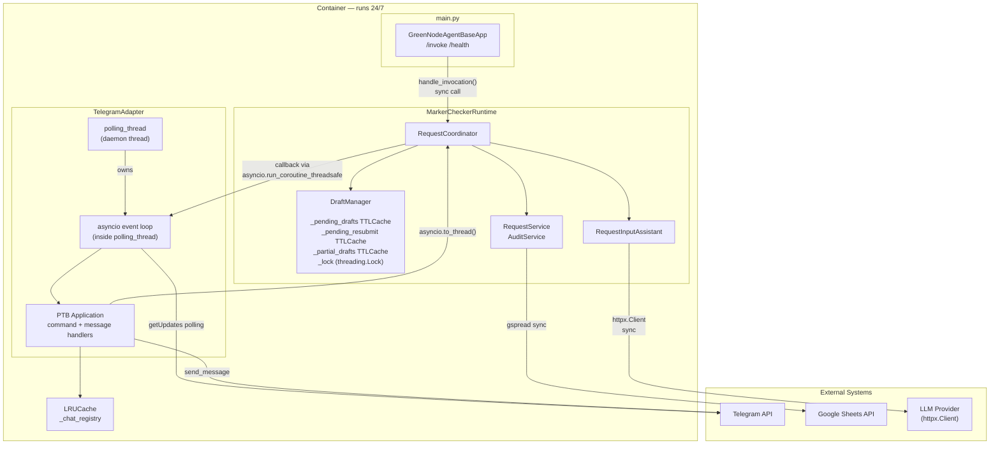
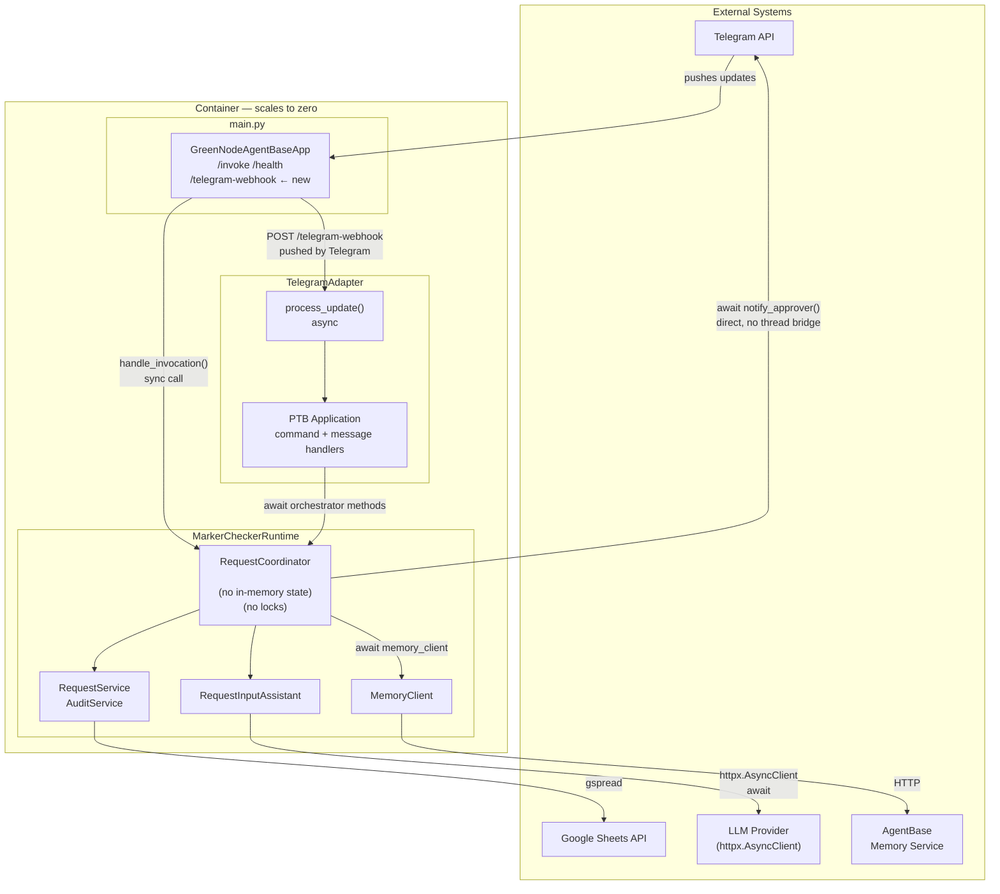
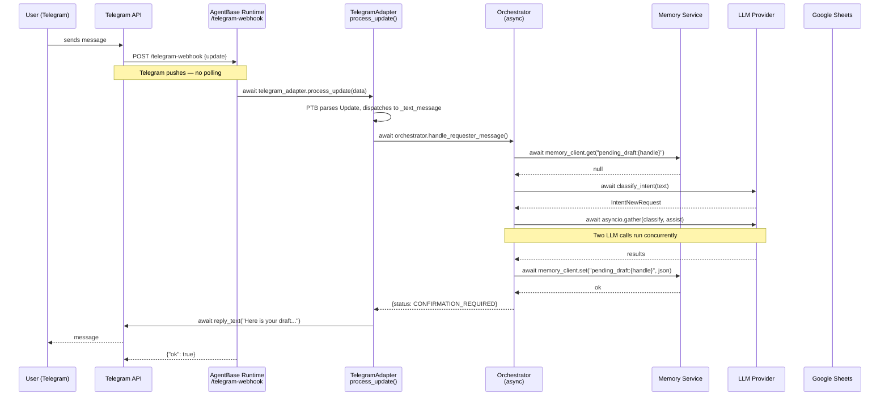
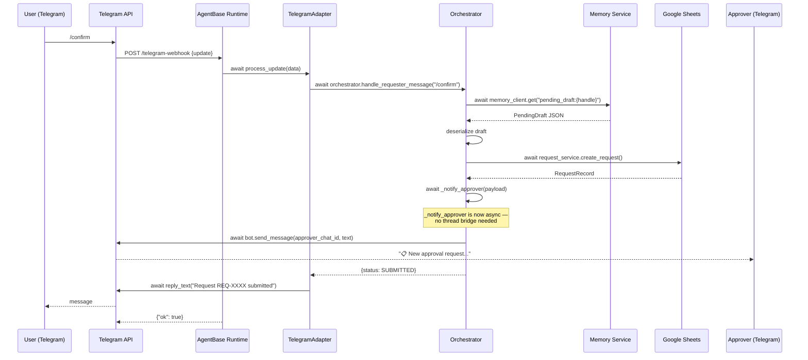

# Architecture Diagrams

Two approaches side by side: current (polling) and target (webhook + AgentBase-native).

---

## Current Architecture — Polling

### Component Overview



### Request Path — Requester sends a message

```mermaid
sequenceDiagram
    participant U as User (Telegram)
    participant TGAPI as Telegram API
    participant LOOP as Polling Loop<br/>(daemon thread)
    participant TP as Thread Pool<br/>(asyncio.to_thread)
    participant ORCH as Orchestrator
    participant LLM as LLM Provider
    participant GS as Google Sheets

    LOOP->>TGAPI: GET getUpdates (every second)
    TGAPI-->>LOOP: [update: text message]
    LOOP->>LOOP: dispatch to _text_message handler (async)
    LOOP->>TP: asyncio.to_thread(orchestrator.handle_requester_message)
    Note over LOOP,TP: Polling loop is freed while orchestrator runs
    TP->>ORCH: handle_requester_message(text, handle)
    ORCH->>ORCH: draft_manager.pop_resubmit(handle)
    ORCH->>LLM: classify_intent(text) [httpx sync]
    LLM-->>ORCH: IntentNewRequest
    ORCH->>LLM: assist_request_text(text) [httpx sync]
    LLM-->>ORCH: AssistedParseResult
    ORCH->>ORCH: draft_manager.set_draft(handle, draft)
    ORCH-->>TP: {status: CONFIRMATION_REQUIRED, message: ...}
    TP-->>LOOP: result dict
    LOOP->>TGAPI: reply_text("Here is your draft...")
    TGAPI-->>U: message
```

### Request Path — /confirm → submit → notify approver

```mermaid
sequenceDiagram
    participant U as User (Telegram)
    participant TGAPI as Telegram API
    participant LOOP as Polling Loop<br/>(daemon thread)
    participant TP as Thread Pool
    participant ORCH as Orchestrator
    participant GS as Google Sheets
    participant APRVR as Approver (Telegram)

    U->>TGAPI: /confirm
    TGAPI-->>LOOP: update
    LOOP->>TP: asyncio.to_thread(orchestrator.handle_requester_message, "/confirm")
    TP->>ORCH: handle_requester_message("/confirm")
    ORCH->>ORCH: draft_manager.pop_draft(handle)
    ORCH->>GS: create_request() [gspread sync]
    GS-->>ORCH: RequestRecord
    ORCH->>ORCH: notifier.notify_approver(payload)
    Note over ORCH: Still in thread pool worker —<br/>cannot await bot.send_message directly
    ORCH->>LOOP: asyncio.run_coroutine_threadsafe(bot.send_message, loop)
    Note over ORCH,LOOP: Cross-thread bridge back into polling loop
    LOOP->>TGAPI: send_message to approver chat_id
    TGAPI-->>APRVR: "📋 New approval request..."
    ORCH-->>TP: {status: SUBMITTED}
    TP-->>LOOP: result dict
    LOOP->>TGAPI: reply_text("Request REQ-XXXX submitted")
    TGAPI-->>U: message
```

---

## Target Architecture — Webhook + AgentBase-Native

### Component Overview



### Request Path — Requester sends a message (webhook)



### Request Path — /confirm → submit → notify approver (webhook)



---

## Key Differences

| | Current (Polling) | Target (Webhook) |
|---|---|---|
| Thread model | 2 threads: main + polling daemon | 1 async event loop |
| Telegram receive | daemon thread polls every ~1s | Telegram pushes POST per message |
| State storage | in-process TTLCache | AgentBase Memory Service |
| Notification path | `asyncio.run_coroutine_threadsafe` cross-thread | direct `await bot.send_message` |
| LLM calls | sync `httpx.Client`, sequential | `httpx.AsyncClient`, `asyncio.gather` concurrent |
| AgentBase billing | container idle 24/7 | per-invocation |
| Observability | container stdout only | per-invocation logs + latency |
| Startup | always running | scale-to-zero, cold start ~2s |
