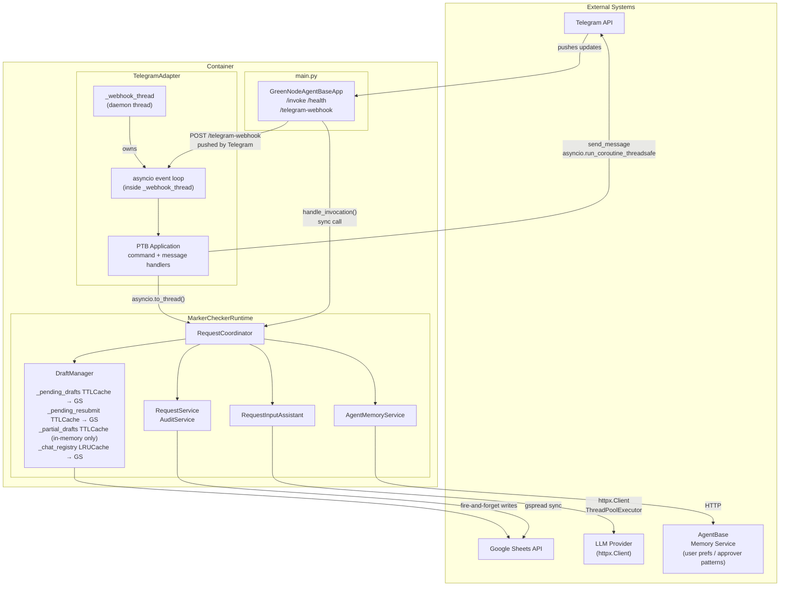
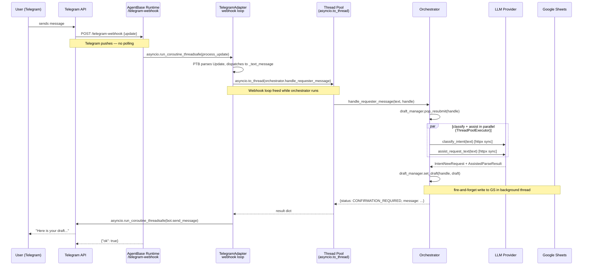
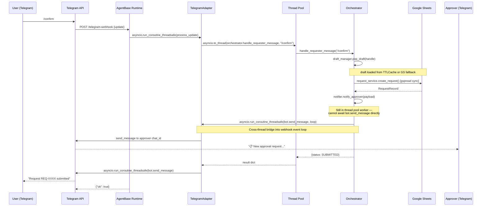
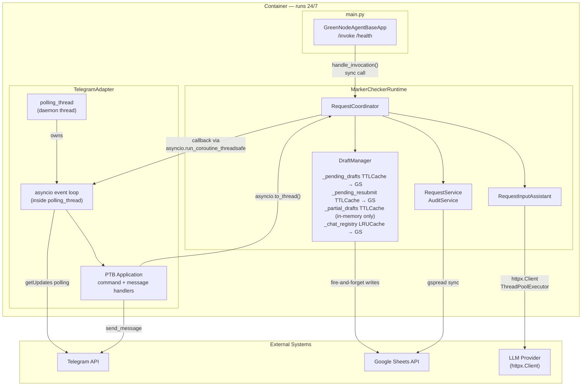
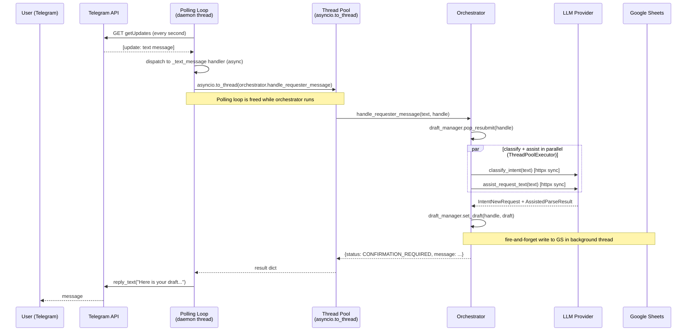
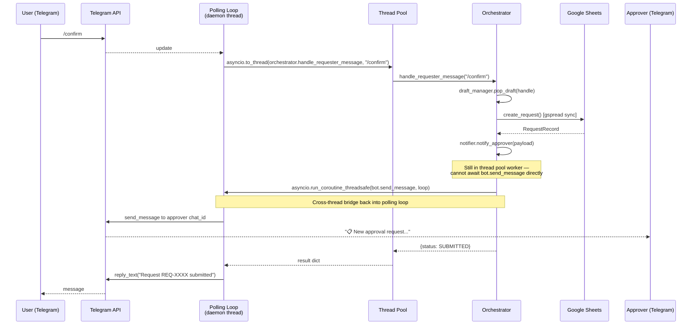

# Architecture Diagrams

Current architecture uses webhook mode in production. Polling mode is available as a local
development fallback (`TELEGRAM_MODE=polling` via `runtime.local.yaml` or env var).

---

## Current Architecture — Webhook

### Component Overview

### Request Path — Requester sends a message (webhook)

### Request Path — /confirm → submit → notify approver (webhook)

---

## Polling Mode — Local Development Fallback

Set `telegram.mode: polling` in `runtime.local.yaml` (or `TELEGRAM_MODE=polling` env var). No `GREENNODE_ENDPOINT_URL` required.

### Component Overview (Polling)

### Request Path — Requester sends a message (polling)

### Request Path — /confirm → submit → notify approver (polling)

