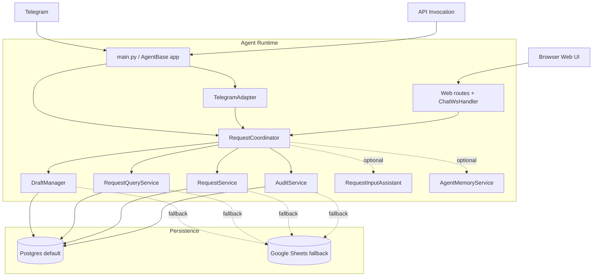
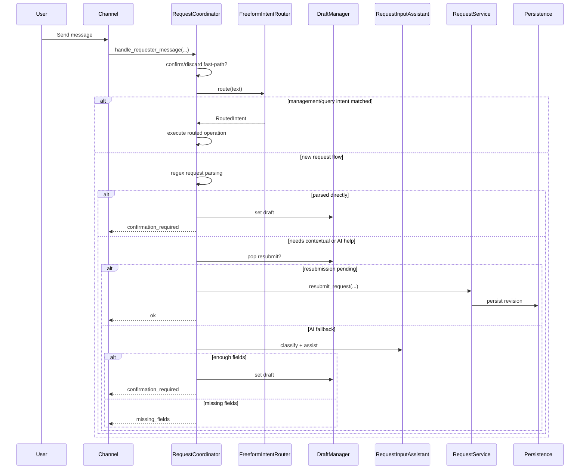
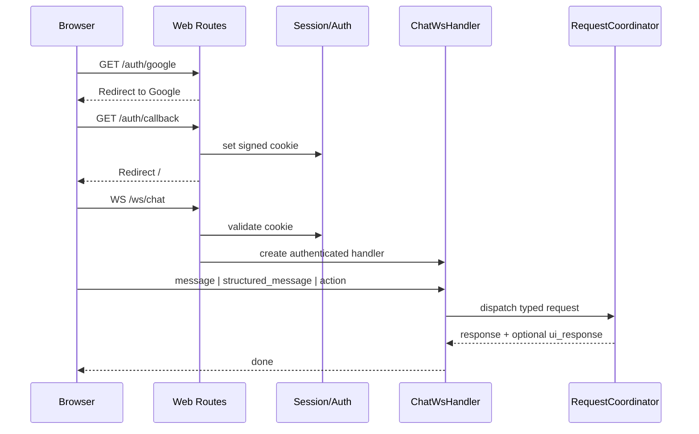
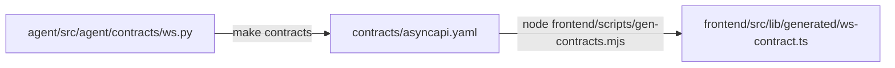

# Architecture Diagrams

Supplementary diagrams for the current implementation. The primary narrative stays in [Architecture](./architecture.md); this file exists for readers who want visual flow references.

## Current Runtime

## Requester Message Path

## Web Channel

## Contract Generation

