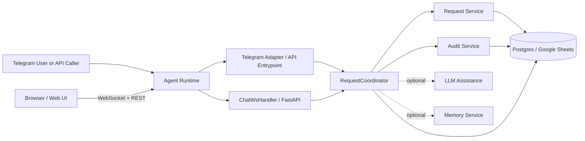

# Technical Architecture

## Goal

Keep the system small and easy to operate.

The first release only needs:

- one agent runtime
- one Telegram adapter
- one workflow core
- one persistence backend
- one optional LLM layer

## Concept Diagram



## Main Layers

### Channel Layer

- Telegram adapter
- API invocation entrypoint
- Web UI channel (FastAPI routes + WebSocket)

This layer only receives messages and sends responses.

### Workflow Layer

- `RequestCoordinator`
- `DraftManager`
- `RequestService`
- `AuditService`
- `RequestQueryService`
- `FreeformIntentRouter`

This layer owns request flow, transitions, and audit behavior.

### AI Layer

- optional LLM assistance

This layer is advisory only. It helps with parsing and wording, but it does not own workflow state.

### Persistence Layer

- `WorkflowStore`
- `PostgresWorkflowStore` (default)
- `GoogleSheetsWorkflowStore` (legacy fallback)

This layer hides storage details from workflow code.

## Key Design Rules

- workflow state is rule-based
- adapters do not change request state directly
- AI is optional and non-authoritative
- persistence backend is behind an abstraction (`WorkflowStore`) so it can be swapped via config

## Main Components

| Component | Responsibility |
| --- | --- |
| `TelegramAdapter` | Telegram webhook (production) and polling fallback (local dev), command handling |
| `ChatWsHandler` | WebSocket handler for the web UI — implements `WsChatHandlerBase`, dispatches typed client messages to `RequestCoordinator` |
| `RequestCoordinator` | route messages and coordinate workflow |
| `DraftManager` | write-through cache for draft and resubmit state (TTLCache + PostgreSQL / Google Sheets backing) |
| `RequestService` | create and transition requests |
| `AuditService` | append and read audit events |
| `RequestQueryService` | lookup, history, search, requester-pending, and approver-pending read operations |
| `FreeformIntentRouter` | map natural-language management commands to workflow/query operations before AI fallback |
| `RequestInputAssistant` | optional LLM parsing and response help |
| `AgentMemoryService` | optional AgentBase Memory Service for user preferences and approver patterns |
| `PostgresWorkflowStore` / `GoogleSheetsWorkflowStore` | persist requests, audit history, and session state (Postgres is default; Google Sheets is legacy fallback) |

## Runtime Composition

`MarkerCheckerApp` is the composition root for the backend runtime. It wires config, persistence, workflow services, adapters, and notification callbacks in one place before the container starts serving traffic.

Startup composition order:

1. load `RuntimeConfig`
2. build and initialize the configured `WorkflowStore`
3. construct `AuditService` and `RequestService`
4. build optional `RequestInputAssistant` and `AgentMemoryService`
5. construct `RequestCoordinator`
6. construct `TelegramAdapter`
7. register approver and requester notification callbacks back into the coordinator

At runtime, `handle_invocation` acts as the API-facing dispatcher:

- `request_message` goes to `RequestCoordinator.handle_requester_message`
- approver operations (`approve`, `reject`, `needinfo`, `cancel`) go to `handle_approver_action`
- `resubmit`, `lookup`, `history`, `my_pending`, and `pending_approvals` route to their dedicated coordinator methods
- a small alias map normalizes external operation names such as `need_info` and `show_request` before enum parsing

## Request Flow Routing

Inbound requester text goes through these stages inside `RequestCoordinator`:

1. explicit draft commands such as `confirm` and `discard`
2. freeform management intent routing via `FreeformIntentRouter`
3. fast-path pattern parsing for new requests
4. contextual resubmission if the user is in a `needs_info` loop
5. optional AI assistance if rule-based parsing did not resolve the message

This ordering keeps common workflow operations deterministic and cheap, while still allowing AI assistance for ambiguous or incomplete requests.

## In-Memory State and Caching

Session state is managed by `DraftManager`, a dedicated class that owns three bounded TTL caches using `cachetools`:

| Cache | Purpose | Eviction |
| --- | --- | --- |
| `_pending_drafts` | draft waiting for `/confirm` | 1 hour TTL, max 256 entries |
| `_pending_resubmit` | contextual resubmit after NEEDINFO | 24 hour TTL, max 256 entries |
| `_partial_drafts` | mid-conversation MISSING_FIELDS follow-up | 5 min TTL, max 256 entries |

The Telegram adapter keeps a `_chat_registry` (handle → chat_id) as an `LRUCache` (max 4096 entries, no TTL), persisted to the backing store (PostgreSQL or Google Sheets) and loaded on startup.

All three `DraftManager` caches share a single `threading.Lock` because `TTLCache` is not thread-safe.

The Google Sheets store caches raw worksheet values for 15 seconds per worksheet to avoid redundant API reads. The cache is invalidated immediately after every write. (This caching layer is not needed for the Postgres backend.)

`_pending_drafts` and `_pending_resubmit` use a write-through cache pattern: mutations write to `TTLCache` immediately and persist to PostgreSQL (or Google Sheets) in a background thread. State is loaded from the backing store on startup, so it survives container restarts. `_partial_drafts` (5 min TTL) remains in-memory only — loss on restart is acceptable for this short-lived intermediate state.

## Async I/O Pattern

The Telegram event loop runs in a daemon thread (polling or webhook). All orchestrator calls that involve I/O (LLM requests, Sheets reads/writes) are dispatched via `asyncio.to_thread`, keeping the event loop free to handle other messages while waiting.

For new-request processing, `classify_intent` and `assist_request_text` run concurrently via `ThreadPoolExecutor(max_workers=2)` (speculative execution). Total LLM latency drops from sequential (`classify + assist`) to parallel (`max(classify, assist)`).

The LLM client reuses a single `httpx.Client` instance across calls for TCP connection pooling.

## Persistence Backend

### PostgreSQL / Neon (default)

- free tier with no auto-pause under regular traffic
- thread-safe `ThreadedConnectionPool`, `ON CONFLICT DO UPDATE` upserts
- DDL auto-runs on startup — no manual schema migration

### Google Sheets (legacy fallback)

- simple setup, no database provisioning
- not suited for high write volume or multi-replica concurrency
- activate with `persistence.backend: google_sheets`

## Key Record Sets

At a high level, the persistence layer stores:

- `requests` for the canonical request state
- `audit_events` for the timeline and actor trail
- `request_conversations` for linking requests to channel-specific conversation context
- `chat_registry` for Telegram handle-to-chat resolution
- `pending_drafts` and `pending_resubmit` for workflow state that survives restarts
- `user_profiles` for Google-authenticated web users in the Postgres backend

For field-level details, see [Data Model Audit](../product-spec/data-model-audit.md).

## Telegram Mode

| | Polling (local dev) | Webhook (production) |
| --- | --- | --- |
| Portability | Runs anywhere | Requires `GREENNODE_ENDPOINT_URL` |
| Scale-to-zero | No | Yes |
| State survival on restart | Yes — persisted through the configured backing store | Yes — persisted through the configured backing store |
| Per-invocation observability | No | Yes |
| Local debugging | Easy | Requires ngrok |

Set `telegram.mode: webhook` in `runtime.yaml` (production default). Override with `runtime.local.yaml` (`mode: polling`) for local development.

## Web Channel

The web UI connects to `WS /ws/chat` and exchanges discriminated-union messages identified by the `type` field.

**Client → Server:** `WsTextMessage` (free-text), `WsStructuredMessage` (full form payload), `WsActionMessage` (confirm/discard draft).

**Server → Client:** `WsTypingMessage` (processing indicator), `WsDoneMessage` (response + optional `UiResponse`), `WsErrorMessage`.

All message types are defined as Pydantic models in `agent/src/agent/contracts/ws.py`. The `WsContract` declaration object states which types belong to which direction. Handler coverage is enforced via `WsChatHandlerBase` (ABC) — `ChatWsHandler` in `agent/src/agent/web/chat_ws.py` implements one method per client message type.

## Notification Routing Rules

The system notifies both approvers and requesters, but channel choice depends on request origin and actor identity rather than a single global notifier.

- approver notifications are fanned out to both channel-specific notifiers: Telegram and the web notification hub
- requester notifications route by `origin_channel_id`
- if `origin_channel_id` looks like an email address, the requester is treated as a web user and the web notification hub is used
- otherwise, requester follow-up goes through the Telegram adapter
- when the approver action is performed by the same web user who originally created the request, the coordinator skips the extra requester notification to avoid echoing the result back into the same active session

This means maintainers should preserve `origin_channel_id` semantics when changing request creation or notification code. It is the key field that decides where follow-up messages go.

### WS Contract Pipeline

```text
agent/src/agent/contracts/ws.py   (Pydantic models + WsContract + WsChatHandlerBase)
          │
          │  make contracts
          ▼
contracts/asyncapi.yaml           (auto-generated AsyncAPI 3.0.0 spec)
          │
          │  node frontend/scripts/gen-contracts.mjs
          ▼
frontend/src/lib/generated/ws-contract.ts   (TypeScript interfaces, JSDoc from docstrings)
```

Run `make contracts` any time the Python models change. Never edit `asyncapi.yaml` or `ws-contract.ts` by hand.

## Code Map

The source tree is organized by responsibility rather than framework layer:

- `agent/src/agent/adapters/` — Telegram-specific transport and command handling
- `agent/src/agent/ai/` — LLM client, prompts, and assisted parsing/summary helpers
- `agent/src/agent/contracts/` — typed WS contract definitions shared with the frontend
- `agent/src/agent/domain/` — enums and core workflow data models
- `agent/src/agent/parsing/` — rule-based request parsing and freeform intent routing
- `agent/src/agent/persistence/` — storage abstraction plus Postgres and Google Sheets implementations
- `agent/src/agent/services/` — request mutation, audit, transitions, and read/query services
- `agent/src/agent/web/` — auth, web routes, session handling, WebSocket plumbing, browser notifications
- `frontend/src/components/chat/` — main chat UI building blocks
- `frontend/src/hooks/` — session and WebSocket client behavior
- `frontend/src/lib/` — UI response shaping, formatting, diff helpers, generated contract bindings

## Notes

- Postgres is the default persistence backend.
- Google Sheets remains available as a simpler legacy fallback.
- The web UI reuses the same workflow core instead of creating a separate approval path.
