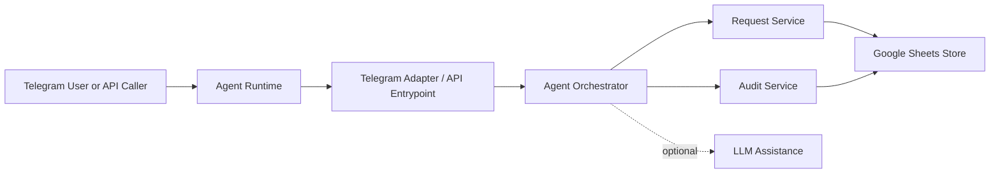

# Technical Architecture

## Goal

Keep the system small and easy to operate.

The first release only needs:

- one agent runtime
- one Telegram adapter
- one workflow core
- one persistence backend
- one optional LLM layer

## Concept Diagram

## Main Layers

### Channel Layer

- Telegram adapter
- API invocation entrypoint

This layer only receives messages and sends responses.

### Workflow Layer

- `AgentOrchestrator`
- `RequestService`
- `AuditService`

This layer owns request flow, transitions, and audit behavior.

### AI Layer

- optional LLM assistance

This layer is advisory only. It helps with parsing and wording, but it does not own workflow state.

### Persistence Layer

- `WorkflowStore`
- `GoogleSheetsWorkflowStore`

This layer hides storage details from workflow code.

## Key Design Rules

- workflow state is rule-based
- adapters do not change request state directly
- AI is optional and non-authoritative
- Google Sheets is behind an abstraction so it can be replaced later

## Main Components

| Component | Responsibility |
| --- | --- |
| `TelegramAdapter` | Telegram polling and command handling |
| `AgentOrchestrator` | route messages and coordinate workflow |
| `RequestService` | create and transition requests |
| `AuditService` | append and read audit events |
| `RequestInputAssistant` | optional LLM parsing and response help |
| `GoogleSheetsWorkflowStore` | persist requests and audit history |

## In-Memory State and Caching

The orchestrator keeps session state in bounded TTL caches using `cachetools`:

| Cache | Purpose | Eviction |
| --- | --- | --- |
| `_pending_drafts` | draft waiting for `/confirm` | 1 hour TTL, max 256 entries |
| `_pending_resubmit` | contextual resubmit after NEEDINFO | 24 hour TTL, max 256 entries |
| `_partial_drafts` | mid-conversation MISSING_FIELDS follow-up | 5 min TTL, max 256 entries |

The Telegram adapter keeps a `_chat_registry` (handle → chat_id) as an `LRUCache` (max 4096 entries, no TTL).

All three orchestrator caches share a single `RLock` because TTLCache is not thread-safe.

The Google Sheets store caches raw worksheet values for 15 seconds per worksheet to avoid redundant API reads. The cache is invalidated immediately after every write.

This in-memory design means state does not survive a process restart. That is acceptable: session state (drafts, pending actions) is short-lived, and durable data lives in Google Sheets.

## Async I/O Pattern

The Telegram polling loop is fully async (python-telegram-bot v21+). All orchestrator calls that involve I/O (LLM requests, Sheets reads/writes) are dispatched via `asyncio.to_thread`, keeping the event loop free to handle other messages while waiting.

The LLM client reuses a single `httpx.Client` instance across calls for TCP connection pooling.

## Why Google Sheets

- simple to set up
- no separate database deployment
- enough for a small internal workflow

Tradeoff:

- not ideal for high write volume or multi-replica concurrency
