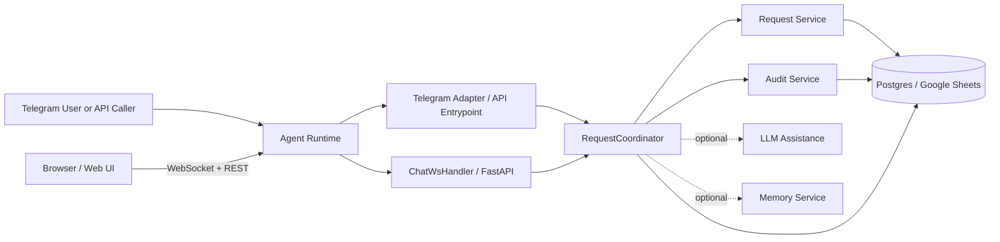

# Technical Architecture

## Goal

Keep the system small and easy to operate.

The first release only needs:

- one agent runtime
- one Telegram adapter
- one workflow core
- one persistence backend
- one optional LLM layer

## Concept Diagram



## Main Layers

### Channel Layer

- Telegram adapter
- API invocation entrypoint
- Web UI channel (FastAPI routes + WebSocket)

This layer only receives messages and sends responses.

### Workflow Layer

- `RequestCoordinator`
- `DraftManager`
- `RequestService`
- `AuditService`

This layer owns request flow, transitions, and audit behavior.

### AI Layer

- optional LLM assistance

This layer is advisory only. It helps with parsing and wording, but it does not own workflow state.

### Persistence Layer

- `WorkflowStore`
- `PostgresWorkflowStore` (default)
- `GoogleSheetsWorkflowStore` (legacy fallback)

This layer hides storage details from workflow code.

## Key Design Rules

- workflow state is rule-based
- adapters do not change request state directly
- AI is optional and non-authoritative
- persistence backend is behind an abstraction (`WorkflowStore`) so it can be swapped via config

## Main Components

| Component | Responsibility |
| --- | --- |
| `TelegramAdapter` | Telegram webhook (production) and polling fallback (local dev), command handling |
| `ChatWsHandler` | WebSocket handler for the web UI — implements `WsChatHandlerBase`, dispatches typed client messages to `RequestCoordinator` |
| `RequestCoordinator` | route messages and coordinate workflow |
| `DraftManager` | write-through cache for draft and resubmit state (TTLCache + PostgreSQL / Google Sheets backing) |
| `RequestService` | create and transition requests |
| `AuditService` | append and read audit events |
| `RequestInputAssistant` | optional LLM parsing and response help |
| `AgentMemoryService` | optional AgentBase Memory Service for user preferences and approver patterns |
| `PostgresWorkflowStore` / `GoogleSheetsWorkflowStore` | persist requests, audit history, and session state (Postgres is default; Google Sheets is legacy fallback) |

## In-Memory State and Caching

Session state is managed by `DraftManager`, a dedicated class that owns three bounded TTL caches using `cachetools`:

| Cache | Purpose | Eviction |
| --- | --- | --- |
| `_pending_drafts` | draft waiting for `/confirm` | 1 hour TTL, max 256 entries |
| `_pending_resubmit` | contextual resubmit after NEEDINFO | 24 hour TTL, max 256 entries |
| `_partial_drafts` | mid-conversation MISSING_FIELDS follow-up | 5 min TTL, max 256 entries |

The Telegram adapter keeps a `_chat_registry` (handle → chat_id) as an `LRUCache` (max 4096 entries, no TTL), persisted to the backing store (PostgreSQL or Google Sheets) and loaded on startup.

All three `DraftManager` caches share a single `threading.Lock` because `TTLCache` is not thread-safe.

The Google Sheets store caches raw worksheet values for 15 seconds per worksheet to avoid redundant API reads. The cache is invalidated immediately after every write. (This caching layer is not needed for the Postgres backend.)

`_pending_drafts` and `_pending_resubmit` use a write-through cache pattern: mutations write to `TTLCache` immediately and persist to PostgreSQL (or Google Sheets) in a background thread. State is loaded from the backing store on startup, so it survives container restarts. `_partial_drafts` (5 min TTL) remains in-memory only — loss on restart is acceptable for this short-lived intermediate state.

## Async I/O Pattern

The Telegram event loop runs in a daemon thread (polling or webhook). All orchestrator calls that involve I/O (LLM requests, Sheets reads/writes) are dispatched via `asyncio.to_thread`, keeping the event loop free to handle other messages while waiting.

For new-request processing, `classify_intent` and `assist_request_text` run concurrently via `ThreadPoolExecutor(max_workers=2)` (speculative execution). Total LLM latency drops from sequential (`classify + assist`) to parallel (`max(classify, assist)`).

The LLM client reuses a single `httpx.Client` instance across calls for TCP connection pooling.

## Persistence Backend

### PostgreSQL / Neon (default)

- free tier with no auto-pause under regular traffic
- thread-safe `ThreadedConnectionPool`, `ON CONFLICT DO UPDATE` upserts
- DDL auto-runs on startup — no manual schema migration

### Google Sheets (legacy fallback)

- simple setup, no database provisioning
- not suited for high write volume or multi-replica concurrency
- activate with `persistence.backend: google_sheets`

## Telegram Mode

| | Polling (local dev) | Webhook (production) |
| --- | --- | --- |
| Portability | Runs anywhere | Requires `GREENNODE_ENDPOINT_URL` |
| Scale-to-zero | No | Yes |
| State survival on restart | Yes — Google Sheets write-through | Yes — Google Sheets write-through |
| Per-invocation observability | No | Yes |
| Local debugging | Easy | Requires ngrok |

Set `telegram.mode: webhook` in `runtime.yaml` (production default). Override with `runtime.local.yaml` (`mode: polling`) for local development.

## Web Channel

The web UI connects to `WS /ws/chat` and exchanges discriminated-union messages identified by the `type` field.

**Client → Server:** `WsTextMessage` (free-text), `WsStructuredMessage` (full form payload), `WsActionMessage` (confirm/discard draft).

**Server → Client:** `WsTypingMessage` (processing indicator), `WsDoneMessage` (response + optional `UiResponse`), `WsErrorMessage`.

All message types are defined as Pydantic models in `agent/src/agent/contracts/ws.py`. The `WsContract` declaration object states which types belong to which direction. Handler coverage is enforced via `WsChatHandlerBase` (ABC) — `ChatWsHandler` in `agent/src/agent/web/chat_ws.py` implements one method per client message type.

### WS Contract Pipeline

```text
agent/src/agent/contracts/ws.py   (Pydantic models + WsContract + WsChatHandlerBase)
          │
          │  make contracts
          ▼
contracts/asyncapi.yaml           (auto-generated AsyncAPI 3.0.0 spec)
          │
          │  node frontend/scripts/gen-contracts.mjs
          ▼
frontend/src/lib/generated/ws-contract.ts   (TypeScript interfaces, JSDoc from docstrings)
```

Run `make contracts` any time the Python models change. Never edit `asyncapi.yaml` or `ws-contract.ts` by hand.

## AgentBase Migration Status

| Phase | Work | Status |
| --- | --- | --- |
| 1 — Externalize state | `_pending_drafts`, `_pending_resubmit`, `_chat_registry` → Google Sheets write-through cache | ✓ Done |
| 2 — Webhook | `/telegram-webhook` route, `setWebhook` via `GREENNODE_ENDPOINT_URL` | ✓ Done |
| 3 — Concurrent LLM | `ThreadPoolExecutor` for `classify_intent` + `assist_request_text` in parallel | ✓ Done |
| 4 — Identity Service | Move secrets from `deploy.env` to AgentBase Identity | Blocked — Identity Service not yet accessible |
