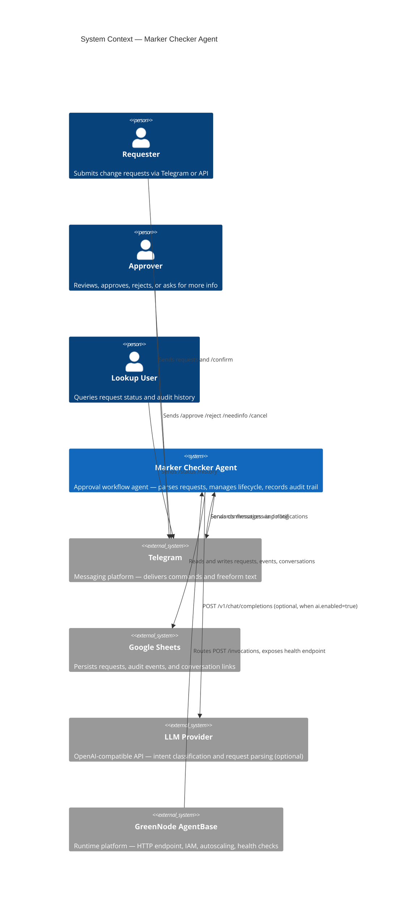
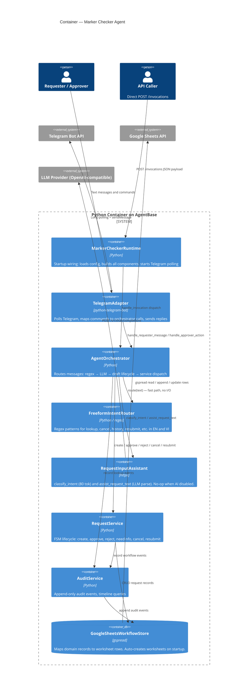
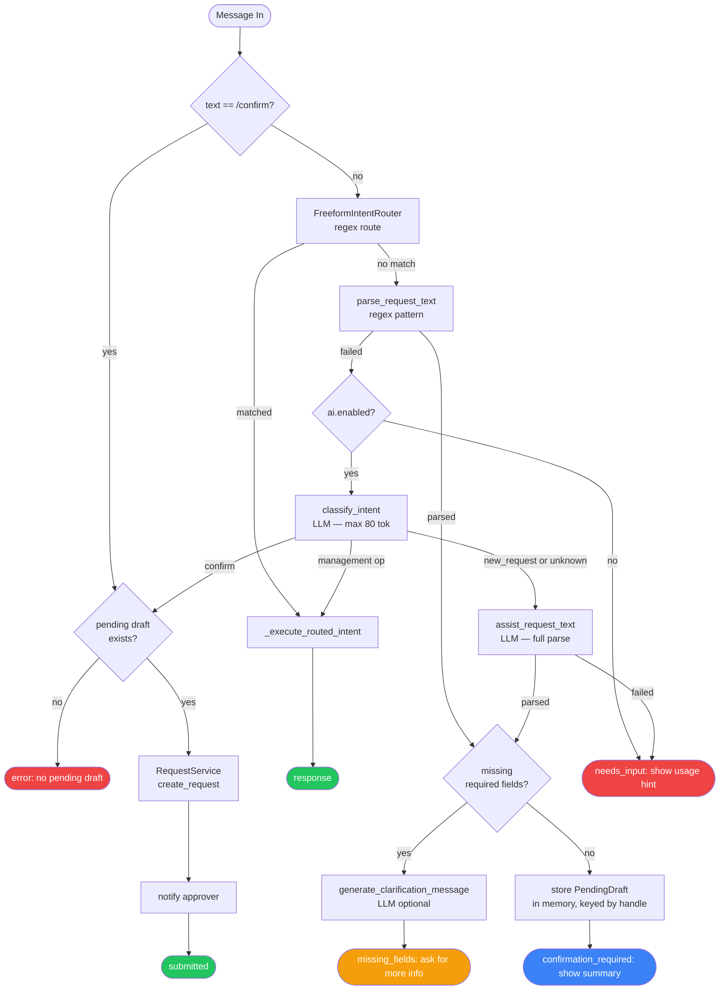
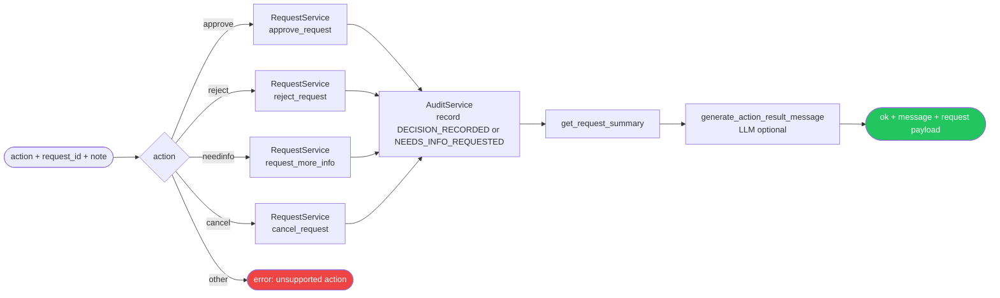
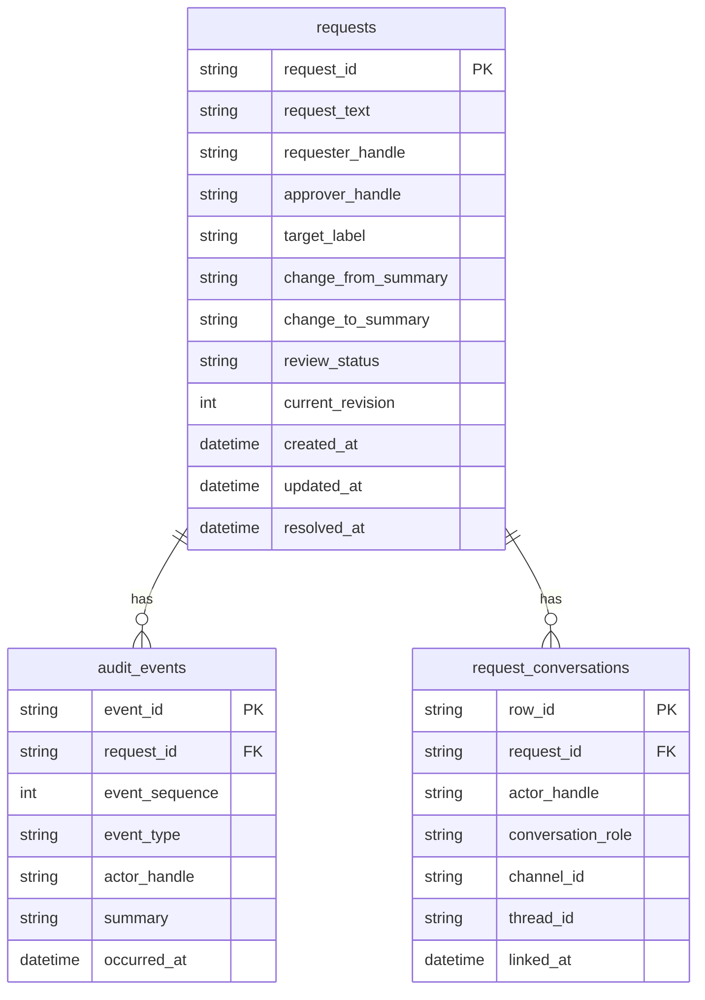

# System Diagrams

## C4 Level 1 — System Context

Who uses the system and what external systems does it depend on.

---

## C4 Level 2 — Container

The internal components running inside the single deployed container.

---

## C4 Level 3 — Request Handling Flow

How `AgentOrchestrator.handle_requester_message` routes a single incoming message.

---

## Approver Action Flow

How `handle_approver_action` processes an approve / reject / needinfo / cancel command.

---

## Persistence Layer

How domain records map to Google Sheets worksheets.

